#   Otomata Sunum

.fx: first

Aydın Doyak `<aydintd@bil.omu.edu.tr>`  

http://aydintd.me/

Nisan 2013

---
##  Sunumu Hazırlayanlar

Mine ÖZTÜRK `<mine.ozturk@bil.omu.edu.tr>`  

Merve ARSLAN `merve.arslan@bil.omu.edu.tr>`  

Şeyma TEKİN `<seyma.tekin@bil.omu.edu.tr>`  

Aydın DOYAK `<aydintd@bil.omu.edu.tr>`  

Koray TAHTA `<koray.tahta@bil.omu.edu.tr>`  

Gözde SEVİNÇ `<gozde.sevinc@bil.omu.edu.tr>`  

---

##  Düzenli İfadeler

.fx: first

10060293  
Mine ÖZTÜRK

---

##  Düzenli İfadeler

*   Düzenli ifade, dil temsiline dayanan tanımlayıcı ifadedir. Düzenli ifadeler
    ile tanımlanan diller düzenli diller (regular languages) olarak
    adlandırılır.

*   Bir dilin tanımlamak için iki bileşenin tanımlanması gerekir : 

**1)** Alfabe tanımlanması

**2)** Hangi kelimelerin dildeki geçerli ifadeler olacağının tanımlanması

---

##  Düzenli İfade Olma Koşulları

*   Bir Σ alfabesi için, r1 ve r2 sırasıyla L1 ve L2 dillerini temsil eden
    düzenli ifadeler olsun.

    +  `Ø  →   L = {Ø}`   Hiçbir eleman içermeyebilir.

    +  `ε  →   L = {ε}`   Boş elemandan oluşabilir.

    +  `a  →   L = {a}`   Bir karekterden oluşabilir.

    +  `r1 + r2  →  L = {L1 U L2}` Toplam İşlemi

    +  `r1r2  →  L = {L1.L2}`  Birleştirme İşlemi

    +  `r*  →  L = {L*}`   Yıldız İşlemi

---

##  Örnekler

*   `Σ  ={x}` olmak üzere;
    `L1={ε , x, xx, xxx, xxxx, ..... }` boş kelime de dahil olmak üzere içerisinde herhangi
    bir  sayıda x sembolü olan tüm kelimelerin dilidir.
    L1 dilini tanımlayan düzenli ifade, `x*`  ifadesidir.   
    Diğer deyişle , `x*` ifadesi   `0 , 1 , 2 , … , n`
    sonsuza kadar giden  sayıda x sembolünden oluşan kelimeleri ifade  eder.

*   `Σ = {a,b}` olmak üzere,
    `L2={a , ab, abb, abbb, abbbb, ..... }` kümesi ile tanımlanan dil, `ab*` düzenli ifadesi
    ile tanımlanabilir.

*   `Σ ={a,b}` olmak üzere
    `L3 = { ε ,  ab,  abab, ababab , ......}`  biçimindeki bir  dil ise,
    `(ab)*` düzenli ifadesi ile tanımlanabilir.

---

##  Örnekler Devam

*   `Σ ={a,b,c}` alfabesi üzerinde tanımlı
    `L4={a, c, ab, cb, abb, cbb, abbb, cbbb, .......}`
     Dili ,  `(a+c)b*`  düzenli ifadesi ile tanımlanır.
     Bu örnekteki  (a+c) ifadesi, parantez içerisindeki
     sembollerden birisinin seçileceği (a veya c) anlamına gelmektedir.
     Seçilen a veya c sembolünü `n = 0,1,2,3, ....` olmak üzere n tane b sembolü izleyebilir.

*   `a*b*` düzenli ifadesi ile tanımlanan dil, boş kelime ve eğer varsa a sembollerinin b
     sembollerinden önce gelmesi ile oluşan kelimelerin dilidir.  
     Bu dil;  
     `L6={ε, a, b, aa, ab, bb, aaa, aab, abb, bbb, aaaa, aaabb, ......}`
     biçiminde de tanımlanır.

---

##  Düzenli ifadelerin NFA'ya Dönüşümü

.fx: first

10060305  
Merve ARSLAN

---

##  Düzenli ifadelerin NFA'ya Dönüşümü

*   Düzenli ifadelerin NFAya dönüştürülmesi **Thompson Algoritması** yardımıyla
    gerçekleştirilir.

*   Gösterimler şu şekildedirler :

`1- Boş eleman ε :` 

`2- a :` 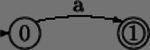

`3- a | b :` 

---

##  Gösterimler

`4- ab :` 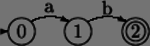

`5- a* :` 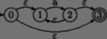

---

##  Örnekler

*   Örnek 1: `a*b*` ifadesini NFA'ya dönüştürelim. Üretilebilecek en kısa
    dizgi (string) `ε` yani boş küme olacaktır. Çünkü yıldız işleminin üreteceği
    sonuçlar arasında boş küme de bulunmaktadır.

İkinci dizgimiz `ab` olacaktır ve bu üretme işlemi
`aab, abb, aabb, aaab, abbb` şeklinde devam edecektir.

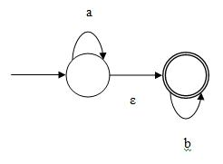

---

##  Örnekler

*   Örnek 2: `L = ab U a*` sözcüğünü NFA'ya çevirin.

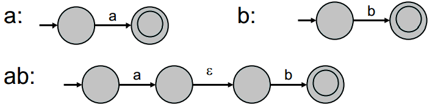

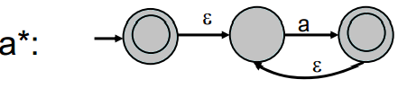

---

##  Örnekler

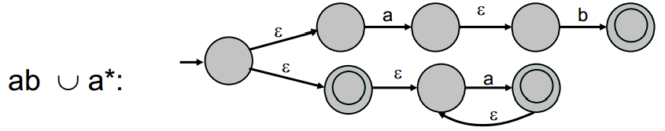

---

##  GNFA (Genelleştirilmiş NFA)

.fx: first

10060311  
Şeyma TEKİN

---

##  Genelleştirilmiş NFA

*   NFA'nın bir varyasyonudur.

*   Girişten RE (Düzenli İfade) ile tanımlanmış bir sembol bloğunu okur ve diğer
    bir duruma bunları oklar aracılığı ile taşır.

*   GNFA 5 niteliğe sahiptir (S, Σ, δ, qstart, qaccept) :

    +  S: sonlu durumlar kümesi

    +  Σ: giriş alfabesi

    +  δ: (S - {qaccept}) x (S - {qstart}) → R

    +  qstart: başlangıç durumu

    +  qaccept: bitiş durumu

---

##  GNFA'nın NFA ve DFA'dan Farkı

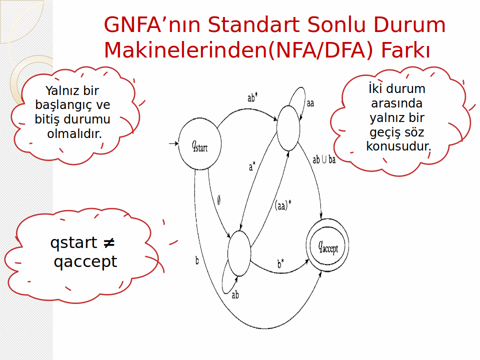

---

##  GNFA'nın Özellikleri

*   Bir GNFA deterministik değildir.

*   Bundan dolayı bir proses için birkaç farklı yol mevcuttur.

*   Bu özelliğe dayanaraktan GNFA -> DFA dönüşümü için **Eleme Yöntemi**
    kullanılır.

---

##  Örnek

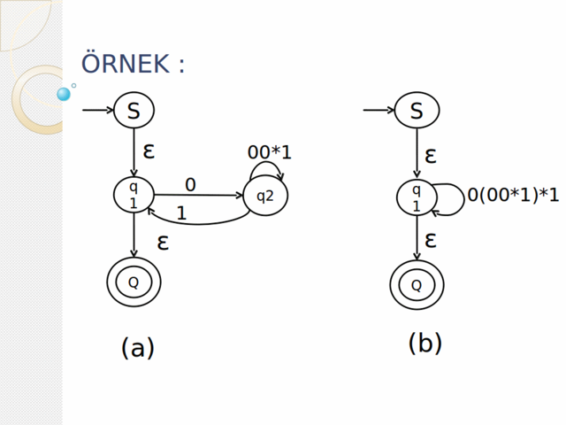

---

##  DFA'dan RE'ye Dönüşüm

*   Bu dönüşüm iki aşamada gerçekleştirilir.

    **1)** DFA'dan GNFA'ya dönüşüm

    **2)** GNFA'dan RE'ye geçiş

---

##  DFA -> GNFA Dönüşümü

*   Yeni birer başlangıç ve bitiş durumu eklenir.

*   Var olan başlangıç durumu ile yeni başlangıç durumu `ε` ile yaratılır. Aynı
    işlem bitiş durumuna da uygulanır.

---

##  GNFA -> RE Geçişi

*   GNFA'dan DFA'ya geçişte kullandığımız **Eleme** yöntemi baz alınarak
    yapılır.

*   İki durum arasında aynı yönde birden fazla geçiş varsa durumlar
    **indirgenerek** diğer durum etiketlerinin birleşimi olan yeni bir geçiş
    elde edilir.

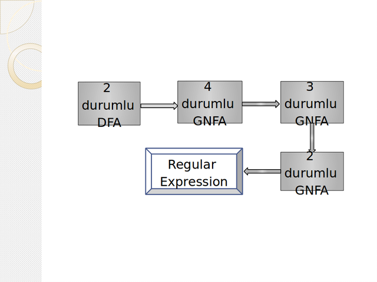

---

##  Convert (G)

*   GNFA k duruma sahip olsun.

*   GNFA olabilmesi için birer başlangıç ve bitiş durumun olması ve bunlarında
    birbirlerinden farklı olması gerektiğini biliyoruz. Buna dayanaraktan k ≥ 2
    diyebiliriz.

*   k > 2 durumunu incelersek:

    +  İndirgeme yaparak k – 1 durumuna sahip eş değerlikli GNFA elde edilir.

    +  Bu indirgeme işlemi k = 2 olana kadar (recursive olarak) devam ettirilir.

    +  Artık GNFA’nın başlangıç ve bitişi arasında tek bir geçiş(ok) vardır.  Bu
       geçişi ifade eden etiket eş değerlikli bir RE’dir.

---

##  Örnek

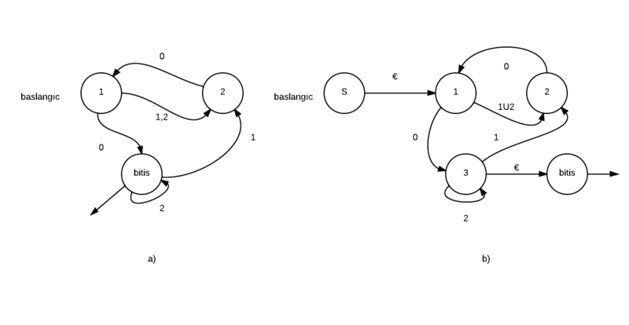

---

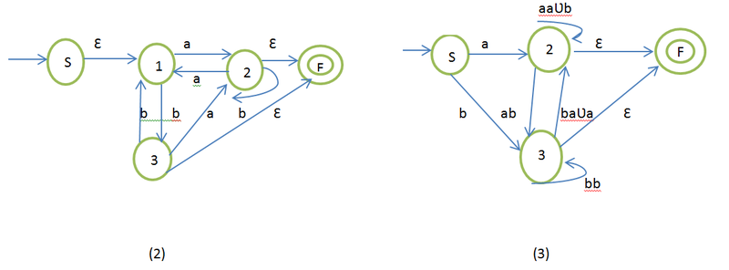

---

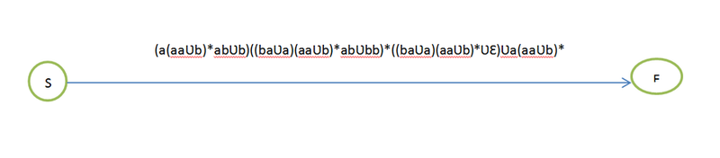

---

##  Düzenli Olmayan Diller

.fx: first

10060270  
Aydın Tunç DOYAK

---

##  Düzenli Olmayan Diller

*   Sonlu otomataların gücünü anlamamız için aynı zamanda limitlerini de iyi
    anlamamız gerekiyor.

*   Düzenli olmayan dilleri anlatmak için aşağıdaki örnek gayet kullanışlı :

*   Örnek : Σ = {0, 1}  

     B = {0ⁿ1ⁿ | n >= 0}

*   Eğer B dili için uygun bir DFA tasarlamaya çalışırsak, makine 1 den önce
    kaç tane 0 girildiğini bilmediğinden bu dilin otomata tarafından kabul
    edilmeyeceğini keşfederiz.

---

##  Düzenli Olmayan Diller

*   Başka bir örneği ele alalım :

*   Örnek :
    Σ = {0, 1}

    A = {w | w eşit sayıda 0 ve 1 lerden oluşur}  

    B = {w | w eşit sayıda 01 ve 10 alt cümlelerinden oluşur}

*   Çözüm :
    Burada ilk bakışta beklediğimiz sonuç, tanımlanan iki dilin de düzensiz
    diller olmasıdır. Ancak çıktılarını incelersek;

    `A → 01, 0011, 000111, 000000..111111..` gibi yukarıdaki örneğe benzediğini ve
    kaç tane 0'ın peşinden kaç tane 1'in geleceğinin takibi yapılamadığından bu
    dil düzensiz bir dildir.

    Ancak  

    `B → 0110, 01011010, 010101101010` görüldüğü gibi bu dil düzenlidir. Çünkü sonsuza
    kadar da gitse, her 0 en az bir 1 ile takip edileceğinden bu dil düzenlidir.

---

##  Düzenli Olmayan Diller

*   B = {0ⁿ1ⁿ | n >= 0}  problemine geri dönülürse; buradaki asıl problem verilen bir sözdeki 
    0'ların kaç tanesinin otomata tarafından algılanabildiğinin ve okunan 0'lara karşılık kaç tane 1'in 0'ları
    takip edeceğinin hesaplanamamasıdır.

*   Bu problemin çözümü basit bir hafıza mekanizmasıyla çözülebileceği çok
    bellidir. Eğer makine kaç tane 0'ı giriş olarak aldığını bilirse, bu dilin
    sözcükleri de otomata tarafından kabul edilebilirdi.

*   Bu da bize, bir dilin düzenli olup olmadığına karar verebilmemiz için
    matematiksel kanıtlara ihtiyacımız olduğunu anlatır.

---

##  Düzenli Diller İçin Pumping Lemma

.fx: first

10060314  
Koray TAHTA

---

##  Pumping Lemma Şartları

*   `W = xyz`  W stringi üç parçaya ayrılabilmelidir.

*   `Her i >= 0; x yⁿ z ε L`

*   `|y| > 0`  Orta kısım boş olamaz, y != NULL

*   `|xy| <= p` Pumping ilk p sembol için meydana gelir.

---

##  Pumping Lemma Şartları

*   Bir dilin düzenli (regular) olmadığını ispatlamak için kullanılan
    bir kanıtlama yöntemidir.

*   L düzenli bir dil olsun. Bu dil için pumping number isimli bir "p" sayısı
    mevcuttur. Bu dil içerisinden seçilen herhangi bir "w" stringin uzunluğu, p
    sayısına eşit veya daha büyük olmak zorundadır.

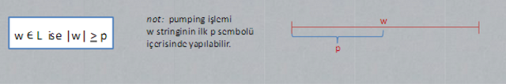

*   L dili düzenli bir dil ise;
    `x, y (y != null) ve z üç adet string olmak üzere; xyⁿz (n = 1,2,3,...)`
    biçimindeki stringler de L dilinin elemanıdır. Aksi halde incelenen dil
    düzenli bir dil değildir.

---

*   w = bbbababa
    x = bb
    y = bba
    z = baba

*   b bba bba baba ε L olmalıdır.

*   b bba bba bba baba ε L olmalıdır.

*   x yⁿ z ε L olmalıdır.

---

##  Pumping Lemma Geliştirilmiş Versiyon

*   Örnek : Palindrome dilinin düzgün olmayan bir dil olduğunu ıspatlayınız.

*   Çözüm : N = 77 durum olduğunu varsayınız.
    w = xyz = a⁸⁰ba⁸⁰ olsun.  

    |w| = 161 ve 161 > 77 olduğuna dikkat ediniz.

*   |x + y| < 77 olacak şekilde parçalarsak;

    a⁷⁵ a a⁴ba⁸⁰ >> x = a⁷⁵, y = a, z = a⁴ba⁸⁰ 

*   x yⁿ z = a⁷⁵aa..a a⁴ba⁸⁰ ε Palindrome olmalıdır.  
    Fakat, a⁸¹ba⁸⁰ ≠ ε Palindrome olduğundan bu dil düzensiz bir dildir.

---

##  Soru Çözümleri

.fx: first

10060315  
Gözde SEVİNÇ

---

##  Örnek

*   `L = { w ∈ {a, b}* : w e it sayıda a ve b’ya sahiptir}` dili

regular değildir.

*   İspat :

    Eğer L dili regular ise, regular bir dil ile kesişim işlemi kapalı
    olur.

    Ancak `L ∩ a*b*` kesişiminin sonucunda elde edilen dil

    `{aⁿ bⁿ : n >=0 }` olur.

    `{aⁿbⁿ : n >=0 }` regular dil olmadığı için L dili de regular
    değildir.

    Bunu gösterecek olursak:
    `(L = { a^ib^i : i>=0 }` dili regular değildir.

---

*   İspat :

    w = aⁿbⁿ ∈ L olduğunu varsayalım.
    Pumping teoreminden `w = xyz` yazılabilir.  
    `|xy| <= n` alınırsa ve `y ≠ ε, y = a^i, i > 0` değerleri için
    y’nin çıkarıldığı string olan `xz = a^(n-i)b^n` olur ve L diline
    ait değildir.  
    Bu sonuç `y = b^i, i > 0` içinde aynıdır.
    Böylece bu dil regular değildir.

*   Örnek:

    `L = {ab, abba, aabb, abab, aaabbb,...},`
    `L(a*b*) = {a, b, aa, ab, aab, bb, aabb, abbbb, aaabbb, ...}`
    `L ∩ a*b* = {ab, aabb, aaabbb, ...}`

---

##  Quiz Zamanı...

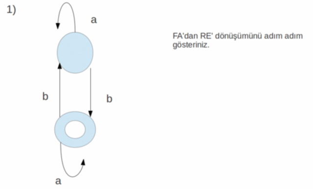

2) L = {0i | i  tam kare olmak üzere } dilinin düzensiz bir dil olduğunu gösteriniz.

---

