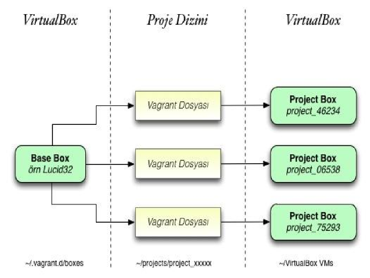

#   Vagrant

.fx: first

Aydın Doyak `<aydintd@bil.omu.edu.tr>`

http://aydintd.me/

Kasım 2012

---

##  Vagrant

Hafif, taşınabilir ve tekrar tekrar üretilebilir geliştirici ortamlarının
oluşturulması ve yönetilmesi için tasarlanmış bir proje

*   Hafif. Çünkü bir kaç komutla ihtiyacımız olan ortamı kendi isteklerimiz
    doğrultusunda oluşturabiliyoruz

*   Taşınabilir. Aynı proje üzerinde birden çok kişiyle çalışılan bir senaryoda
    Vagrant hızlı ve güvenilir

*   Tekrarlanabilir ve çoğaltılabilir. Tek bir ortamı, farklı 
    geliştirici makineler üzerinde defalarca oluşturabiliyoruz

*   Kısaca esnek ve verimli

---

##  Vagrant Nedir?

*   Özgür ve açık kaynak kodlu bir proje

*   Vagrant'ın kendisi bir VM programı değil

    +  Herşeyden önce VirtualBox kurulumuna ihtiyaç duyar

*   Geliştirici makine üzerinde sanal makineler oluşturup
    bu makineleri yönetmemizi sağlayan bir Ruby Kütüphanesi

*   Sanal makinelerin yönetimiyse rake komutlarıyla yapılıyor

*   Özellikle geliştirme ortamında kullanılmak üzere hazırlanmış

*   Kullanımı basit ve pratik

---

##  Kullanım Senaryoları

Bir uygulama geliştirme projesinde olduğunuzu varsayalım

*  İhtiyaç duyduğunuz ortamlar var (Ör: Rails Sunucu, Mysql Sunucu vb.)  
   Bu ortamlar Vagrantla bir sanal makine olarak karşınızda

*  Üstelik aynı makineyi çok hızlı bir şekilde paylaşabiliyor ve   
   değiştirebilip, kaydedebiliyorsunuz

*  Uygulamanız bir yere kadar geldi ve kritik bir durumdan geçmekte  
   hızlı bir geri besleme almak istiyorsunuz

*  Çalışmanızı Vagrantla oluşturduğunuz makinede dilediğinizce   
   değiştirip, gereken test sürüşünü çok hızlı ve güvenli şekilde
   yapabiliyorsunuz

---

##  Özet

Geliştirme > Sahneleme > Son ürün

*  Bu yolda ilerleyen uygulamalar için geliştiricilere,      
   tekrarlanabilir, taşınabilir, güvenilir ve esnek bir şekilde gereken
   ortamı sağlamak

Peki tüm bu hikaye ne? Bir de Vagrant yaratıcısından duyalım

---

##  Vagrant'a Başlarken

> **Vagrant özgür ve açık kaynak kodlu bir projedir. Projenin vizyonu, günümüzde
> sanal bir ortam üzerinde, geliştirme yapmanın doğuracağı karmaşık ihtiyaçları,
> geliştiricinin günlük iş akışını aksatmaksızın, transparan bir şekilde
> yönetebileceği araçları sağlamaktır.**
>> **M. Hashimoto, J. Bender**

---

##  Vagrant Kurulumu

*  Sisteminizin güncel olduğuna ve sisteminizde Virtualbox kurulu olduğundan emin olun

        !sh
        $ sudo apt-get upgrade && sudo apt-get update

http://downloads.vagrantup.com

*   Linkten işletim sisteminize uygun olan son sürüm paketi indirin

*   İndirdiğiniz .deb paketini sisteminize kurun, 32 bit ve 64 bit sürümler mevcut

        !sh
        $ sudo dpkg -i vagrant_1.3.1_i686.deb

*   Herşey yolunda gittiyse vagrant komutlarını çalıştırabiliyor olmalısınız

        !sh
        $ vagrant -T

---

##  Kutular

Vagrant herşeyden önce sanal makine kutularına ihtiyaç duyuyor

*   Bu kutulara temel kutu (base box) deniyor

*   Bu temel kutu, yine sanal makine kutuları oluşturmak için kullanılıyor

*   Bu kutulara ise "Project Box" yani proje kutusu diyoruz

Proje kutuları temel kutudan oluşturuluyor

*   Bir temel kutudan birden çok ve birbirinden farklı proje kutusu oluşturulabilir

*   Her proje kutusunun öntanımlı gelen bir ayar dosyası var, ismiyse "Vagrantfile"

*   Bu dosya ilerde kuracağımız sanal makinemizi yöneteceğimiz dosya olacak

---

##  Kutular

*   Temel kutuların bulunduğu dizin burada

        !sh
        ~/.vagrant.d/boxes

*   Kutuların tek farkı oluşturmak istediğiniz sanal makinenin işletim sistemleri

*   Bu ayrımı kutulara o dağıtımın sürüm etiketi verilerek belirleniyor

*   Örneğin Ubuntu 12.04 sürümünün etiketi **Precise Pangolin**

*   Ubuntu 12.04 kuracağımız vagrant temel kutumuzun adı da **precise** olacak

*   Bu şart değil, temel kutunuzun adı istediğiniz herhangi bir isim olabilir, ancak konvansiyon bu şekilde

---

##  Kutular

---

##  Kutu Yönetimi

*   Kutuların yönetimi gayet kolay

        !sh
        $ vagrant box [program] [arguman]

*   Var olan kutuları listeleyebiliyoruz

        !sh
        $ vagrant box list

*   Kutu eklemek istediğimiz zaman

        !sh
        $ vagrant box add [kutu-adi] [kutu-linki]

*   Kutu silmek istediğimiz zaman

        !sh
        $ vagrant box remove [kutu-adi]

*   Peki kutu adı ne olacak?

---

## Precise32

Bu bir temel kutu

*   Vagrantla oluşturmak istediğimiz sanal ortamın temel imajı

Sanal makine oluşturduğumuzda mimari tercihimiz her zaman 32 bit

*   Kutu adının precise olmasının sebebi bu folyoda örnek olarak Ubuntu 12.04 imajı hazırlanacak olması

*   Bu yüzden kutumuza isim olarak precise32 yi seçiyoruz

Vagrant sanal makineleri oluştururken Virtualbox sayesinde precise32 imajının
bire bir kopyaları üzerinde çalışmaya olanak sağlıyor

*   Bu dilediğimiz gibi sanal makine üzerinde değişiklik yapabilmemizi mümkün
    hale getiriyor

---

##  Precise32

*   Kutuyu vagrantla locale ekleyin

        !sh
        $ vagrant box add precise32 http://files.vagrantup.com/precise32.box

*   Hali hazırda bir çok işletim sisteminin temel kutuları internette bulunmakta

http://www.vagrantbox.es/

*   Yukarıdaki adresten isteğinize göre bir çok kutu imajı indirebilirsiniz

*   Eklediğiniz kutu temel kutularınızda görünüyor olmalı

        !sh
        $ vagrant box list
        -> precise32 (virtualbox)

*   Kutumuz yeni proje kutuları oluşturmak için hazır durumda

*   Aynı şekilde başka temel kutuları sisteme indirebilirsiniz, birden çok temel kutuyla çalışmak mümkün

---

##  Proje Kutuları

Proje kutularını oluşturmak için bir "projects" dizininiz olmalı

*   "projects" içerisine "proje-ismi" şeklinde başka bir dizin açın

*   Bunun sebebi aynı temel kutuyu kullanarak birden fazla proje kutusuyla
    çalışabilmenize olanak yaratmak

Oluşturduğunuz proje-ismi dizini içerisine sanal makinenizi kurmak için

        !sh
        $ vagrant init

*   Daha önce bahsettiğimiz "Vagrantfile" dosyasının proje kutunuz içerisinde
    belirdiğini göreceksiniz

---

##  Vagrantfile

Öntanımlı değerlerle gelen proje kutularınızın ayar dosyası

*   Sanal makineyi buradan konfigure ediyoruz

Vagrantfile içersinde temel kutuyu tanımla

        !sh
        config.vm.box = "base"

*   Bu kısmı "base" yerine "precise32" olarak ya da sistemde var olan başka bir sanal imajla değiştir

*   Projeyi başlattığınızda vagrant, Vagrantfile dosyasını kullanarak proje sanal
    sistemini oluşturacak

---

##  Başlatma

*   Projeyi başlatın, aşağıdaki gibi bir çıktı göreceksiniz

        !sh
        $ vagrant up
        -> [default] Importing base box 'precise32'...
        -> [default] Matching MAC address for NAT networking...
        -> [default] Clearing any previously set forwarded ports...
        -> [default] Forwarding ports...
        -> [default] -- 22 => 2222 (adapter 1)
        -> [default] Creating shared folders metadata...
        -> [default] Clearing any previously set network interfaces...
        -> [default] Booting VM...
        -> [default] Waiting for VM to boot. This can take a few minutes.
        -> [default] VM booted and ready for use!
        -> [default] Mounting shared folders...
        -> [default] -- v-root: /vagrant

---

##  Görüntüleme

*   Sanal makinenizin içine göz atın

        !sh
        $ vagrant ssh
        -> Linux precise32 2.6.32-38-server #83-Ubuntu SMP Wed Jan 4 11:26:59 UTC
        2012 x86_64 GNU/Linux
        -> Ubuntu 12.04 LTS
        ->
        -> Welcome to the Ubuntu Server!
        ->  * Documentation:  http://www.ubuntu.com/server/doc
        -> New release 'precise' available.
        -> Run 'do-release-upgrade' to upgrade to it.
        ->
        -> Welcome to your Vagrant-built virtual machine.
        -> Last login: Fri Sep 14 07:31:39 2012 from 10.0.2.2
        -> vagrant@precise32:~$

*   Sanal makine kullanıma hazır

*   İşiniz bittiğinde "exit" diyerek çıkın

---

##  Sustur 

Vagrantı durdumak için üç seçenek var

*   Bunlardan biri susturmak

        !sh
        $ vagrant suspend

*   VM uyku moduna geçer

*   Kutular arası kısa-süreli geçişler için kullanın

---

##  Durdur

İkinci seçenek durdumak

        !sh
        $ vagrant halt

*   VM durdurulur, servisler kapatılır

*   Proje üzerinde yakın zamanda çalışılacaksa bu seçenek mantıklı

---

##  Yoket

Yoket VM'i projeniz için oluşturulmuş diskten siler

        !sh
        $ vagrant destroy

*   Proje üzerinde uzun süre çalışmayacaksanız bu komutu kullanın

*   Daha sonra tekrar çalışmak istediğinizde

        !sh
        $ vagrant up

*   Vagrantfile sayesinde tekrar bu kutu üzerinde çalışabilirsiniz

---

##  Kaynak

*   http://www.vagrantup.com
